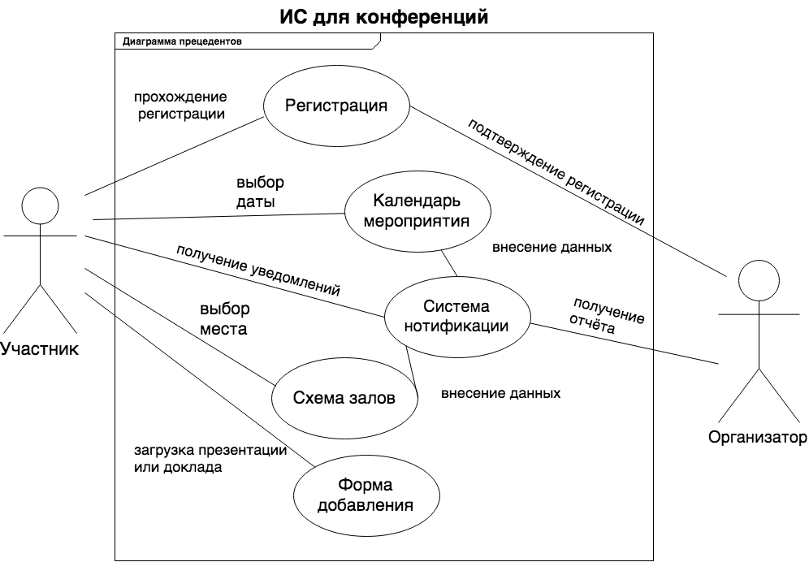
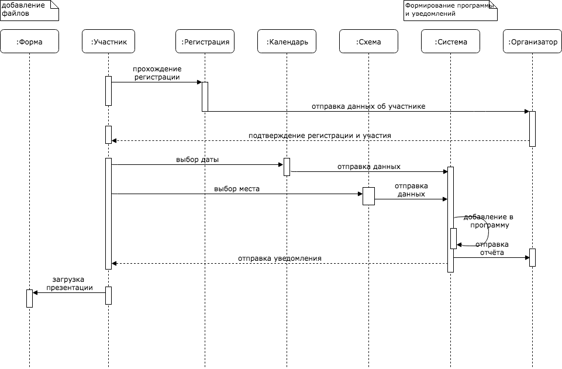

# Результаты выполнения задания

## Диаграмма прецедентов

## Диаграмма последовательности

## Ответы на вопросы
### Специалисты
  * дизайнер
  * специалист по юзабилити
  * верстальщик на фронт
  * 2 программиста (фронт + бэк)
  * тестер
### Этапы
  1. Создание ТЗ на дизайн (ЦА, облик, цели, требования)
  2. Дизайн
  3. Правки с участием специалиста по юзабилити и верстальщика
  4. Доработка дизайна
  5. Вёрстка
  6. Сдача готовой вёрстки на подключение CMS
  7. Тестирование фронта + бэка
  8. Релиз
### SCRUM
* 1st sprint
 * Анализ ЦА
 * Анализ функионала
 * Проектирование основного функционала CMS
 * Проектирование добавочного функционала CMS
 * Проектирование внешнего облика
 * Дизацн страниц
 * Дизайн страниц и форм
* 2nd sprint
 * Правка дизайна со специалистом по юзабилити
 * Согласование дизайна с заказчиком
 * Вёрстка шаблонов и форм
* 3rd spint
 * Создание (или написание необходимых модулей) CMS
 * Подключение первых готовых шаблонов 
 * Тестирование
